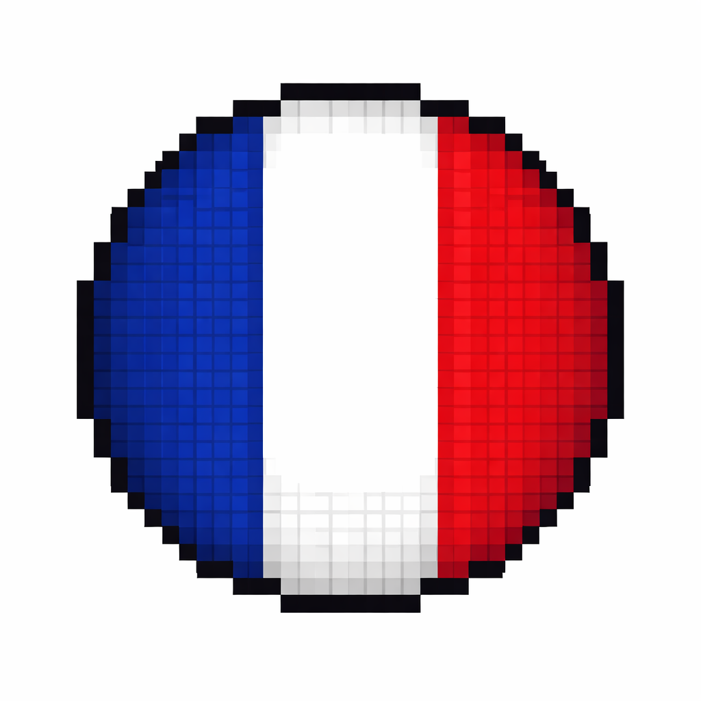
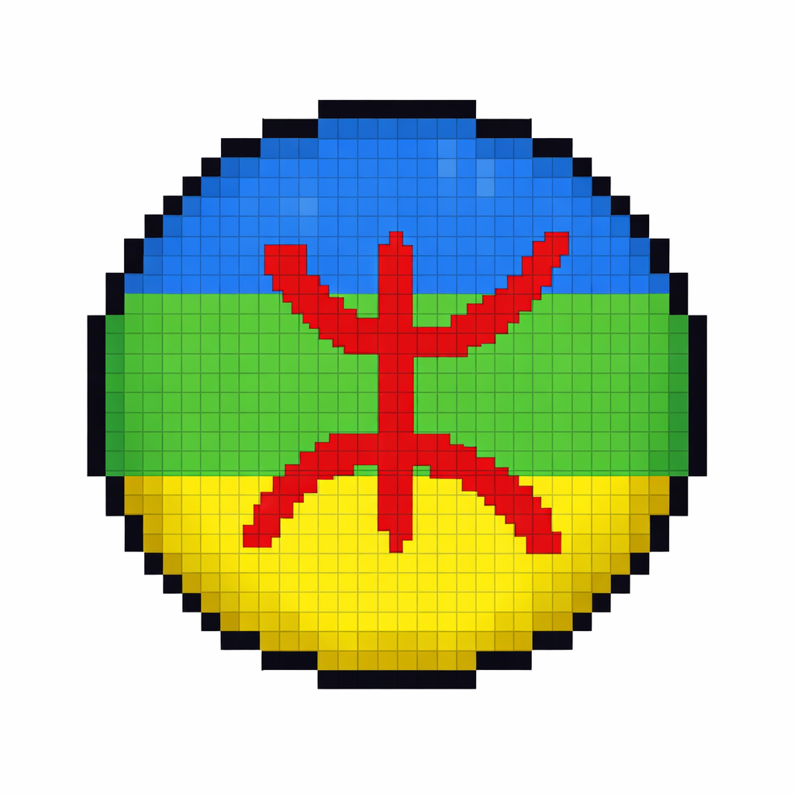

# Hi I'm Lyliane 🌸

  

  
   
  <em>this is my cat Nala 🐾❤️</em>

---

### About Me

> *"The question isn't who's going to let me — it's who's going to stop me."*

I don't wait to understand everything before I start. I learn by doing, fix as I go, and I never stay stuck for long. Machines, networks, industrial systems. I want to know what's underneath, how it breaks, and how to make it work better than before. I ended up in industrial engineering not by accident but because I wanted something real. Systems that run factories, secure infrastructures, connect the physical and digital worlds. Being a woman here was never the point. The work was.

---

### Languages

 &nbsp;
 &nbsp;
 &nbsp;

---

### Tech Stack

#### Industrial & OT/IT

#### Cybersecurity

#### Hardware & Embedded

#### Dev & Languages

#### Cloud & DevOps & Infra

#### Data & AI

---

### Connect

  
  &nbsp;&nbsp;
  

  

